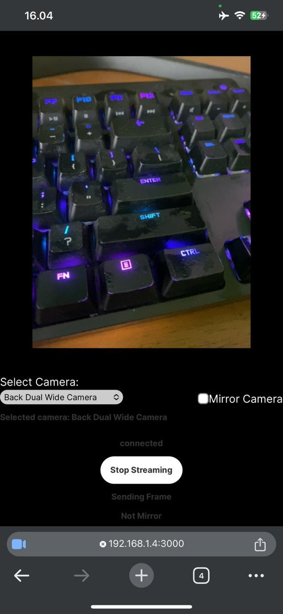

This project is a Webcam For PC using a Phone.

© Dimas Kurniawan

Node v20.11.1

React Js



## Feature
- full hd
- no watermark
- mirror camera
- switch camera
- start and stop streaming 
- support many phone 
- low latency

## Installation
1. Install Npm Package both on Main directory and Server directory
    ```bash
    npm i 
    ```
2. You need check wss Websoket URL on cameraon.tsx line 33 to Local IP-address

    ```bash
    const startWebSocket = useCallback(() => { 

    socketRef.current = new WebSocket('wss://192.168.1.4:3001'); //change here

    socketRef.current.onopen = () => {
      console.log('WebSocket connected');
      setStatusNetwork('connected');
    };

    socketRef.current.onerror = () => {
      console.error('WebSocket connection error');
      setStatusNetwork('disconnected');
    };
    }, [])
   ```
3. You need check wss Websoket URL on index.html line 11 to Local IP-address

    ```bash
    
    <script>
        const socket = new WebSocket('wss://192.168.1.4:3001'); //change here
        const imageElement = document.getElementById('imageElement');

        socket.onopen = () => {
            console.log('WebSocket connected on the client side');
        };

        const blobUrls = [];

        socket.onmessage = (event) => {
    const message = event.data;

    if (message === 'revokeBlobURL') {
        handleRevokeBlobURL();
    } else {
        handleNormalMessage(message);
    }
    };
    ```

## Usage

1. Run Main Directory 

    ```bash
    npm run dev
    ```

    on Main Directory

    Open [https://Local-IP-address:3000](https://Local-IP-address:3000) on your browser on phone to start the Webcam.


2. Run Server Directory

    ```bash
    npx nodemon server.js
    ```
    on Server Directory

    Open [https://Local-IP-address:3001](https://Local-IP-address:3001) with new tab browser on phone and leave it and then go back to port 3000

3. Open Client

    Open [https://Local-IP-address:3001](https://Local-IP-address:3001) with your browser on pc to see Webcam.

